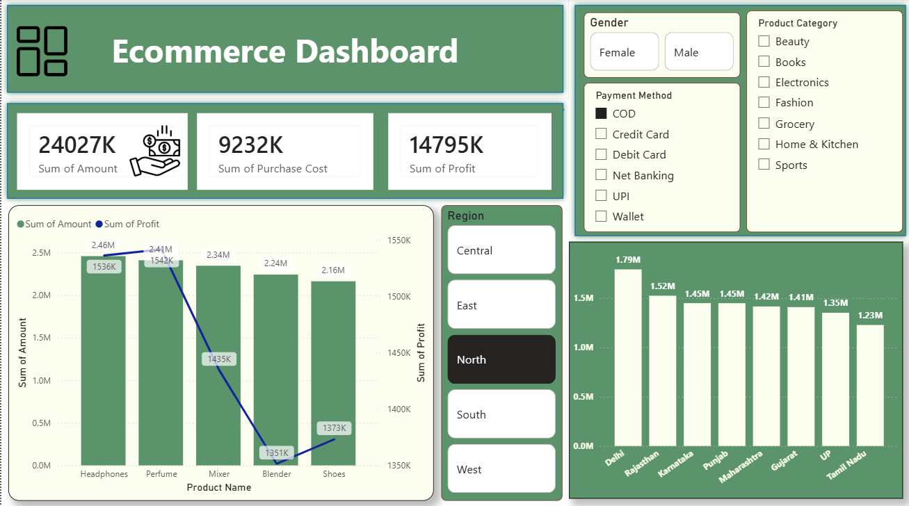

# 🛒 E-Commerce Sales & Profit Dashboard
**Power BI | Advanced Excel | Power Query | DAX**
---

  

## 📌 Overview
Built an interactive dashboard to analyze sales performance and consumer behavior using a dataset of transactions across India.

## 🛠️ Tech Stack & Steps
* **Tools:** Power BI Desktop, Excel, Power Query.
* **ETL:** Cleaned 14+ columns (Customer ID, Product Category, Payment Methods) in Power Query.
* **Modeling:** Built a Star Schema to link sales data with regional and product dimensions.
* **Analysis:** Used DAX to calculate high-level KPIs and profit margins.

## 🚀 Key Features & Results
* **KPI Visualization:** Developed high-level cards to monitor **$24M in Sales** and **$14M in Net Profit**.
* **Geographical Analysis:** Visualized distribution across North, South, East, and West; identified **Delhi and Rajasthan** as top-performing states.
* **Consumer Insights:** Implemented dynamic slicers (**Gender, Category, Payment Method**) to track shopping patterns.

## 📂 Repository Contents
* `E-Commerce_Analysis.pbix`: Interactive Power BI Report.
* `Sales_Data.xlsx`: Cleaned dataset.
* `Screenshots/`: Dashboard preview images.

## 📊 Dashboard Preview

## 🏃 How to Run
1. Download the `.pbix` and `.xlsx` files.
2. Open the `.pbix` file in **Power BI Desktop**.
3. Use Slicers to explore regional and category-wise performance.

---

## 📫 Connect with me:

---
